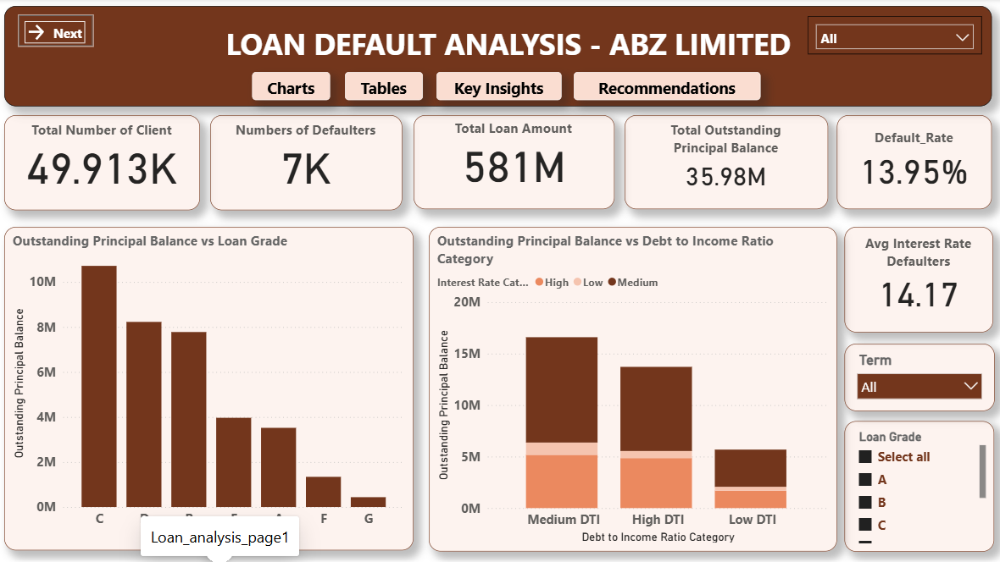
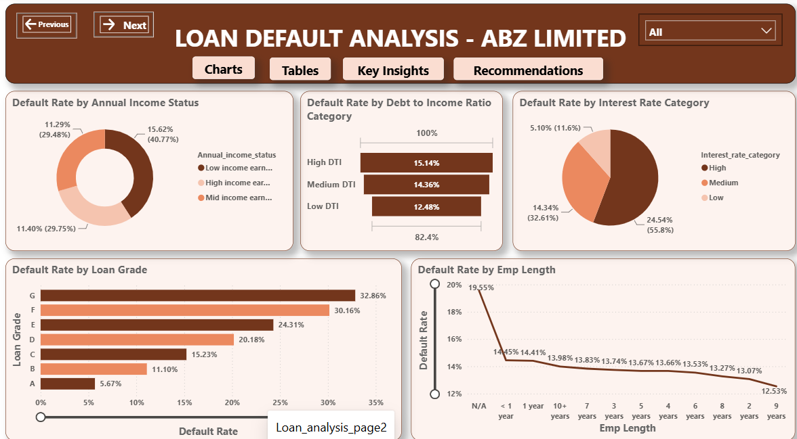

# loan-default-analysis
Exploratory Data Analysis and interactive dashboard to identify factors influencing loan default risk.
# 📊 Loan Default Analysis

## Overview

Financial institutions need to identify high-risk borrowers before approving loans. This project analyzes loan applicant data to uncover patterns associated with loan default and provides insights to support informed lending decisions.

---

## Business Problem

Loan defaults can result in significant financial losses. By analyzing historical loan data, this project identifies characteristics associated with higher default risk to improve decision-making.

---

## Objectives

- Analyze applicant demographics
- Explore loan repayment behavior
- Identify factors influencing loan default
- Build an interactive Power BI dashboard

---

## Tools Used

- Microsoft Excel
- SQL
- Power BI

---

## Dataset

The dataset contains loan applicant information, including:

- Loan ID
- Client ID
- Loan Amount
- Term
- Interest Rate
- Loan Grade
- Annual Income
- Loan status
- Debt-income-ratio

---

## Data Cleaning

- Removed duplicates
- Checked missing values
- Standardized categorical variables
- Verified data consistency

---

## Key Insights

- Lower credit grades (E–G) carry substantially higher default risk.
- Higher interest rates are associated with increased default rates.
- High debt-to-income ratios increase repayment risk.
- Longer employment history generally corresponds to lower default rates.
- Outstanding balances are concentrated among higher-risk borrower segments.
- Income alone is not a sufficient predictor of default.

---

## Dashboard

### Overview




---

## Repository Structure

```

data/
dashboard/
images/
sql/
reports/
README.md

```

---

## Author

**Mercy Daramola**

Junior Data Analyst

LinkedIn:
